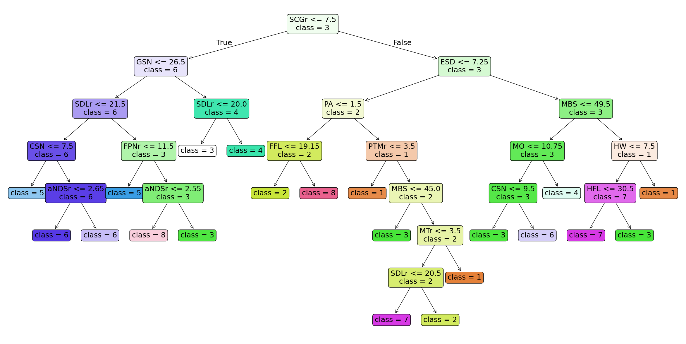
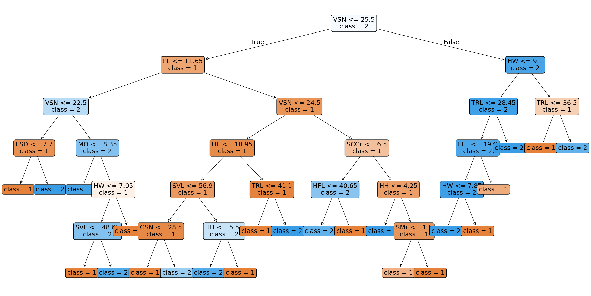

#### Lizard Classification using DecisionTreeClassifier. Species and Sex classification
This project focuses on the classification of biological speciments into 8 different species and 2 gender categories using morphological and folidosis signs

###### Project Structure
.
├── data/                   # Raw dataset
├── config/                 # Configuration data
├── notebook.ipynb          # Main Jupyter Notebook containing analysis
├── task.pdf                # The task that the project is oriented towards
└── requirements.txt        # List of necessary Python libraries

###### Setup
Clone the repo
```Bash
git clone https://github.com/your-username/your-repo-name.git
cd your-repo-name
```

Create and activate virtual enviroment
```Bash
python -m venv .venv
# Windows:
.venv\Scripts\activate
# Linux/macOS:
source .venv/bin/activate
```

Install dependencies
```Bash
python -m pip install -r requirements.txt
```

###### Analysis
A detailed pipeline can be seen in the `notebook.ipynb`. The tree and predictions for classes and genders will be visualized below

**Tree for Species**


**Tree for Sex**


**Predictions**
              precision    recall  f1-score   support

           1       0.74      0.88      0.80        16
           2       0.81      0.81      0.81        16
           3       0.88      0.74      0.81        39
           4       0.88      0.91      0.89        23
           5       0.67      0.67      0.67         6
           6       0.84      0.87      0.85        30
           7       1.00      0.83      0.91         6
           8       0.43      0.60      0.50         5

    accuracy                           0.82       141
   macro avg       0.78      0.79      0.78       141
weighted avg       0.83      0.82      0.82       141
 


              precision    recall  f1-score   support

           1       0.84      0.88      0.86        69
           2       0.88      0.83      0.86        72

    accuracy                           0.86       141
   macro avg       0.86      0.86      0.86       141
weighted avg       0.86      0.86      0.86       141
